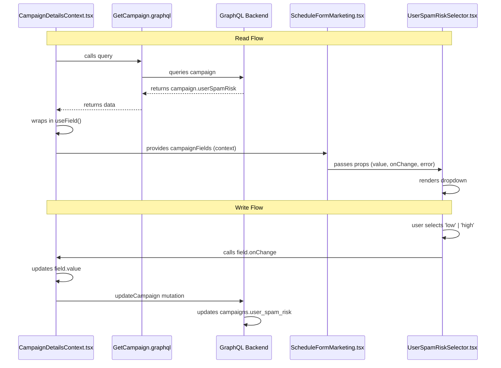

# data-flow [format] [description]

Document the data flow for files changed in a commit/branch to help reviewers understand how data moves through the system.

## Arguments

Both arguments are optional and use smart detection:

- **First argument**:
  - If `tsd` or `mermaid` → treated as format
  - Otherwise → treated as description (format defaults to `tsd`)

- **Second argument** (only used if first is a format):
  - Treated as description

**Format options:**
- `tsd` (default) - Terminal Sequence Diagram, optimized for plain text/terminals
- `mermaid` - Mermaid sequence diagram syntax for rendering in GitHub/docs

**Description examples:**
- "campaign user spam risk feature"
- "files in current branch"
- "files in commit abc123"
- "the authentication flow in LoginForm.tsx"
- If omitted, defaults to documenting files changed in current branch

## Examples

- `/docs:data-flow` - Current branch in TSD format
- `/docs:data-flow mermaid` - Current branch in Mermaid format
- `/docs:data-flow "campaign spam risk"` - Specific feature in TSD format (smart detection)
- `/docs:data-flow tsd "user spam risk feature"` - Explicit TSD format with description
- `/docs:data-flow mermaid "campaign spam risk"` - Specific feature in Mermaid format
- `/docs:data-flow mermaid commit abc123` - Specific commit in Mermaid format

## When to Use

- **PR documentation**: Show how data flows from backend to UI and back
- **Verify correctness**: Help reviewers spot missing error handling, unnecessary transformations, or over-engineering
- **Understand lifecycle**: Make query → transform → display → mutation flows explicit
- **Identify complexity**: See if data is duplicated or stored in multiple places

## Output Formats

### TSD (default)
Use **Terminal Sequence Diagram** notation for plain text environments (terminals, PR descriptions, slack). See TSD standard below.

### Mermaid (optional)
Generate Mermaid sequence diagram syntax for rendering in GitHub, GitLab, documentation sites, or any Mermaid-compatible viewer.

**When to use Mermaid:**
- Documentation sites that render Mermaid
- GitHub/GitLab README or wiki pages
- Visual presentations or architecture docs
- When the audience has rendering capability

**When to use TSD:**
- PR descriptions (plain text)
- Terminal/CLI output
- Code comments
- Slack messages
- Anywhere rendering isn't available

## Key Principles (TSD Format)

1. **Keep it simple and concise** - signal over noise, one line per step
2. **Separate read and write flows** - they're usually different paths
3. **Tag each participant** with letters [A], [B], [C] to make repetition visible
4. **One action per line** - no multi-line entries, pick the most important action
5. **No legends or footnotes** - format must be self-explanatory
6. **Minimal arrows** - use sparingly, only when direction adds clarity
7. **Show what matters** - data transformations, not every micro-step
8. **Full file names always** - never abbreviate without full name present
9. **Number by temporal sequence** - what happens first, second, third

## Example Output

### TSD Format (default)

```
Data Flow - Campaign User Spam Risk

Read Flow:
1. [A] CampaignDetailsContext.tsx
   → calls: GetCampaign.graphql

2. [B] GetCampaign.graphql
   → queries: GraphQL Backend
   ← receives: campaign.userSpamRisk (raw value)

3. [A] CampaignDetailsContext.tsx
   ← receives: campaign.userSpamRisk from query
   • wraps: useField(campaign?.userSpamRisk)
   → provides: campaignFields.userSpamRisk (field object)

4. [C] ScheduleFormMarketing.tsx
   ← receives: campaignFields from context
   → provides: UserSpamRiskSelector.tsx (value, onChange, error)

5. [D] UserSpamRiskSelector.tsx
   ← receives: value, onChange, error props
   • renders: dropdown with field.value

Write Flow:
1. [D] UserSpamRiskSelector.tsx
   • user selects: 'low' | 'high'
   → calls: field.onChange

2. [A] CampaignDetailsContext.tsx
   • updates: field.value

3. Form submission
   → sends: updateCampaign mutation(userSpamRisk)

4. [E] GraphQL Backend
   • updates: campaigns.user_spam_risk
```

### Mermaid Format (with `format=mermaid`)



## Common Pitfalls to Avoid (TSD Format)

❌ **Don't use multi-line entries** - one action per numbered step
❌ **Don't add legends or footnotes** - format must be self-explanatory
❌ **Don't overuse arrows** - only use when direction adds clarity, otherwise just describe the action
❌ **Don't repeat actors without letter tags** - use [A], [B], [C] to make repetition visible
❌ **Don't use abbreviations alone** - always show full file names with extensions
❌ **Don't show every micro-step** - focus on significant data movements and transformations
❌ **Don't add hierarchy/indentation** - flat numbered sequence only

✅ **Do keep it concise** - one line per step, signal over noise
✅ **Do number by actual execution order** - start with whoever initiates the flow
✅ **Do show data transformations** - when shape changes (raw → field → props)
✅ **Do separate read and write flows** - they're usually different sequences
✅ **Do use blank lines** only between flows, not between steps

---

# Terminal Sequence Diagram (TSD) Standard

## Overview

TSD (Terminal Sequence Diagram) is a text-based notation for documenting data flow and interactions between components in a way that's readable in terminals, PR descriptions, and plain text documentation. It bridges the gap between simple numbered lists (too minimal) and visual diagrams like Mermaid (require rendering).

## Core Concepts

### Participants
Files, components, services, or systems that send/receive data. Each participant gets a letter tag [A], [B], [C] for easy tracking across multiple appearances.

### Actions
Operations on data. Use arrows sparingly - only when direction adds clarity. Most actions should just be descriptive verbs (calls, queries, updates, renders, receives, provides).

### Sequence
Numbered steps (1, 2, 3...) showing temporal order - what happens first, second, third.

### Flows
Related sequences grouped together (e.g., "Read Flow", "Write Flow", "Error Flow").

## Syntax

```
Flow Name:
1. [Letter] Participant.file → action description
2. [Letter] Participant.file → action description
```

### Rules

1. **Letter tags are mandatory** - assign [A], [B], [C] to each unique participant in order of first appearance
2. **One line per step** - no multi-line entries, pick the most important action
3. **Full file names required** - always include file extension (.tsx, .graphql, etc.)
4. **One participant per numbered step** - don't combine multiple actors in one step
5. **Blank lines only between flows** - not between individual steps
6. **No legends or footnotes** - format must be self-explanatory
7. **Arrows optional** - use `→` when direction adds clarity, otherwise just describe action
8. **Consistent verbs** - calls, queries, receives, sends, provides, updates, renders, wraps

## Complete Example

```
Data Flow - User Authentication

Login Flow:
1. [A] LoginForm.tsx → user submits email and password
2. [A] LoginForm.tsx → calls login mutation(email, password)
3. [B] GraphQL Backend → validates credentials, returns { token, user }
4. [A] LoginForm.tsx → stores token in localStorage
5. [C] AuthContext.tsx → receives token, updates currentUser state
6. [C] AuthContext.tsx → provides user context to app

Logout Flow:
1. [D] LogoutButton.tsx → user clicks logout
2. [C] AuthContext.tsx → clears currentUser state and localStorage token
3. [A] LoginForm.tsx → receives null user from context, renders login form
```

## Why TSD Works

**For terminals/plain text:**
- No rendering required - works in any text environment
- Monospace-friendly - doesn't rely on visual alignment tricks
- Git-diff friendly - changes are easy to spot

**For comprehension:**
- Letter tags make repetition visible - [A] appearing 3 times shows centrality
- Full names avoid mental lookup - no abbreviation table needed
- Arrows show direction - clear who sends, who receives
- Numbered sequence - explicit temporal order

**For documentation:**
- Self-contained - each step is understandable on its own
- Scannable - letters and numbers provide visual anchors
- Maintainable - easy to add/remove/reorder steps

## Design Decisions

### Why letters [A], [B], [C] instead of abbreviations?
Abbreviations require learning/remembering the mapping. Letters are arbitrary tags that make repetition visible without requiring memorization.

### Why not use hierarchy/indentation for nesting?
Hierarchy implies ownership/containment. In data flow, participants are peers in a sequence, not nested structures. Hierarchy would falsely suggest GetCampaign "owns" CampaignDetailsContext.

### Why separate read/write flows?
They usually involve different participants and different sequences. Mixing them creates confusion about order.

### Why always show full file names?
Terminal viewing means no hover tooltips or hyperlinks. Every step must be self-contained.

### Why minimal arrow usage?
Arrows were initially used heavily (`→` outgoing, `←` incoming, `•` internal) but became visual noise. The descriptor verb (calls, queries, updates) already indicates the action. Use `→` sparingly, only when it adds clarity about direction.

## Version

TSD v1.0 - Created October 2025
